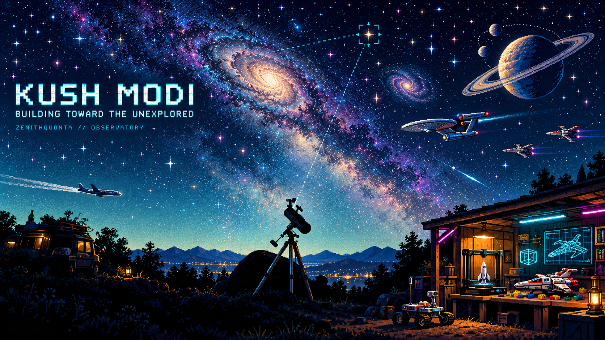
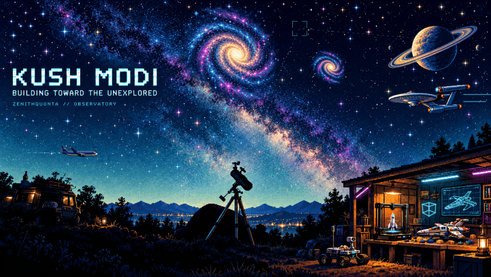

# Kush Modi's Pixel Observatory — full implementation handoff

This is a continuation package, not a request to start the design over. The user approved the illustrated direction and then the animation. The animated deliverable has been built, reviewed against rendered frames and a real browser, and refined (task records T00–T14 in `TASKS.md`). The user published the original package, and the reviewed refinements have been fast-forwarded to `main` (section 10). Read `TASKS.md` for what is still open.





## 1. Objective, identity and approval history

The GitHub account is **Zenithquonta**. The user's existing personal README is in **`Zenithquonta/kushmodi`**, default branch `main`. The display name, sourced from that README, is **Kush Modi**. Do not substitute the account handle for the person's name.

The original request was to improve the GitHub profile using an animated-profile reference. A preliminary ASCII profile implementation was prepared, but the user rejected its appearance. That design is now an archived prototype, not the active design. The user then described astronomy as the strongest passion, followed by innovation, aviation and things beyond reach. They asked to refer to their AstroFixxer repositories for visual language.

The user supplied a photograph of their telescope under the Milky Way and requested a pixel copy, rotating galaxies, planetary imagery, spacecraft, ships, LEGO, 3D printing, CAD, Star Trek/Star Wars influences, and a little cyberpunk. The proposed visual direction was approved. A generated still banner was then shown and the user said it was a good starting point and approved making it animated.

The user explicitly requested removal of clerical-work/employer references and does not want that part of their work shown at this stage. The current public README has been rewritten accordingly. The user also explicitly requested a detailed handoff, all supplied images/SVGs/scripts, an agent supervision loop, and pushing the work to GitHub. No further approval is required for those already-authorized actions in this repository.

## 2. Visual brief

The composition is a personal observatory at the edge of space. The telescope from the real photograph anchors the foreground. There are trees and a dark rocky/campsite horizon, warm city lights and mountains in the distance, a broad teal Milky Way and a deep navy sky. On the right, an open maker workshop has amber windows, restrained cyan/magenta LED strips, a printer, CAD display, interlocking construction bricks, a small brick-built spacecraft, and a rover.

Astronomy is dominant. The spacecraft and workshop support the telescope rather than taking over the scene. Typography must stay readable: `KUSH MODI`, `BUILDING TOWARD THE UNEXPLORED`, and `ZENITHQUONTA // OBSERVATORY`.

The artwork takes AstroFixxer's dark background, electric cyan (`#00bfff`) and celestial targeting language into an illustrated pixel environment. It uses deliberate pixel clusters, dithered light and stepped edges. The space should feel expansive; the cyberpunk aspects are small instruments, holography and LEDs, not a dense neon city.

The user approved Star Trek-inspired exploration vessels and Star Wars-inspired starfighters as visual references. Do not add combat, explosions or massive fleets. Aviation is represented by a small passenger airplane crossing below the starfield. It is an interest, not an invented pilot or aerospace employment credential.

## 3. What exists now

| Item | Status | Location |
| --- | --- | --- |
| User's original telescope photo | Supplied and retained | `assets/reference-telescope.jpg` |
| Approved still banner | Supplied and retained | `assets/approved-concept.png` |
| Clean animation background | Generated from approved banner | `assets/observatory-background.png` |
| Transparent sprite atlas | Generated to match banner | `assets/space-sprites.png` |
| Square pixel profile picture | Generated; small/circular-crop review done (T03), unchanged | `assets/profile-picture.png` |
| Animated layered SVG | Built; 504 animation elements; checked against Chromium in T05/T07/T15 | `assets/observatory.svg` |
| Static SVG at first frame | Built | `assets/poster.svg` |
| Static PNG poster | Rendered with FFmpeg/librsvg, 840×473 | `assets/observatory-poster.png` |
| Looping GIF | Exported at 840px (T08) with the T14 scene additions; metadata/motion checked | `assets/observatory.gif` |
| Navigation cards: 4 animated + 4 static | Built (T13): Observatory, Flight Deck, Fab Lab, Rover Bay | `assets/*-card.svg`, `assets/*-card-static.svg` |
| Public README | Installed (T04); on `main` | `README.md` |
| Interactive local preview | Generated; Chromium-tested at 1280 and 390px (T06) | `preview.html` |
| Preview template and rebuild script | Supplied; selector and focus fixes in T06 | `preview.template.html`, `scripts/build_preview.py` |
| Reproducible animation builder | Supplied; extended by T02-R1, T02-R2, T07, T08, T14 | `scripts/build_animation.py` |
| Card builder | Deterministic over all eight card files | `scripts/build_cards.py` |
| Asset quality gate | Passing | `scripts/quality_gate.py` |
| Source regression tests | 38 tests | `scripts/test_scene.py` |
| CI workflow | Read-only validation (quality gate and unittest); run 36819742217 on `316e993` succeeded | `.github/workflows/validate-profile.yml` |
| Agent gate, protocol, prompt and ledger | Supplied; ledger holds review records | `AGENTS.md`, `docs/AGENT-LOOP.md`, `SUPERVISOR-PROMPT.md`, `TASKS.md` |
| Earlier rejected ASCII SVGs | Reference-only archive | `assets/legacy/` |

The GIF is an actual animation: **840×473**, **240 frames**, **10fps**, **24 seconds**, infinite looping, **8,150,550 bytes**. (The first export was 1000×563 and 11,744,470 bytes; T08 moved to 840px. After T14 it was 7,955,864 bytes; T15 added the living sky.) The animated SVG now has **504 animation elements** (98 in the first package, 264 after T14). The source background is 1672×941; the sprite atlas is 1536×1024 RGBA. Inspect `assets/MANIFEST.json` for final file hashes and metadata rather than relying on prose after later changes.

## 4. Project structure and asset use

```text
AGENTS.md                     agent entry point / gate
HANDOFF.md                    this document
SUPERVISOR-PROMPT.md          ready-to-paste startup instruction
TASKS.md                      retained execution/review ledger
README.md                     public profile
preview.template.html         interactive preview source template
preview.html                  generated self-contained SVG preview
requirements.txt              Pillow for verification only
.github/workflows/validate-profile.yml
assets/
  approved-concept.png
  reference-telescope.jpg
  observatory-background.png
  space-sprites.png
  profile-picture.png
  observatory.svg
  poster.svg
  observatory.gif
  observatory-poster.png
  observatory-card.svg, flight-card.svg, fablab-card.svg, rover-card.svg
  observatory-card-static.svg, flight-card-static.svg, fablab-card-static.svg, rover-card-static.svg
  MANIFEST.json
  legacy/
scripts/
  build_animation.py
  build_cards.py
  build_preview.py
  build_manifest.py
  quality_gate.py
  test_scene.py
docs/
  ANIMATION-SPEC.md
  ASSET-REGISTRY.md
  AGENT-LOOP.md
  PUBLISH-STATUS.md
```

Only the GIF, the poster PNG and the eight card SVGs (animated plus static) are referenced by the public README. The SVG and source images remain available for inspection and regeneration. The local preview embeds the SVG inline for actual browser interactions; it still shows the original three cards. It is not a hosted website and should not be deployed without a separate request.

Retain the approved concept and user photo. If the artwork needs artistic changes, use an image-generation/editing tool and the approved references. Do not overwrite the approved source with a later experiment. Crop/viewbox changes for scene composition belong in the builder; modifications to painted source content need an artistic image edit.

## 5. Reproducible build

Use Python 3.12 or another compatible Python 3 version. The builder uses the Python standard library, Pillow (to find the painted stars that twinkle) and an external FFmpeg executable. The quality gate uses Pillow to inspect image metadata, alpha and sampled frames.

```bash
python -m pip install -r requirements.txt
ffmpeg -hide_banner -decoders
python scripts/build_cards.py                          # 4 animated + 4 static card SVGs
python scripts/build_animation.py --gif --fps 10       # default width is 840 (GIF_WIDTH)
python scripts/build_preview.py                        # embeds assets/observatory.svg in preview.html
python scripts/build_manifest.py                       # refresh assets/MANIFEST.json last
python scripts/quality_gate.py
python -m unittest discover -s scripts -p 'test_*.py' -v   # 38 tests
```

Without `--gif`, `build_animation.py` writes only `observatory.svg`, `poster.svg` and the poster PNG. The manifest builder also needs Pillow. The last verified toolchain (T00) was Python 3.11, Pillow 12.3 and FFmpeg 6.1.1 with the librsvg decoder.

Confirm that the FFmpeg decoder listing includes **librsvg**. This is necessary to rasterize the layered SVG frames. Do not mistake the presence of the FFmpeg command alone for SVG support.

The builder reads the two source PNGs into data URIs, generates the animated SVG and a static SVG, rasterizes the static poster, then optionally exports every time sample for the GIF. Four render workers are used. Each temporary SVG is removed after its PNG frame is produced; the temporary directory is removed after successful completion. A render temporarily consumes significant disk space for PNG frames. The final artifact generation used four workers successfully in the original workspace.

The GIF pipeline creates a shared 256-color palette from all frames (`stats_mode=full`) and uses ordered Bayer dithering with `bayer_scale=5`. This avoids a different palette per frame and keeps static areas from crawling between frames. T08 measured the alternatives (error-diffusion dither, `stats_mode=diff`, 8fps, gifsicle) and rejected them; the encoder rationale is in the comments in `export_gif` and in `docs/ANIMATION-SPEC.md`. Avoid changing palette strategy without viewing the result at normal README size.

The loop period is 24 seconds. `Track` asserts that every animation period divides 24, so the scene wraps cleanly, and a test checks every animation for a jump at the wrap. Review geometry at the wrap rather than assuming mathematically periodic movement guarantees a perceptually clean last-frame transition.

Do not regenerate a GIF after every prose change. A new export is necessary after animation source or source artwork changes. Rebuild `preview.html` after changing `observatory.svg` or its template. Regenerate the asset manifest after final asset changes.

## 6. Animation implementation

The detailed map is in `docs/ANIMATION-SPEC.md`. The builder's major functions are:

| Function / object | Responsibility |
| --- | --- |
| `png_uri` | Read a source PNG into an embedded data URI |
| `sprite` | Select one atlas region through a nested SVG viewport and position its origin |
| `rotate_node` | Place and rotate a sprite, with SMIL for the animated export |
| `Track` | One keyframed animation (`values`, `key_times`, `dur`, `begin`) evaluated by `at(t)` for raster frames and printed by `smil()` for the SVG, so both use identical keyframes (T07). `Track.sine` samples a sine into 24 keyframes; `Track.timeline` builds one-shot sequences that rest at both ends of the cycle |
| `twinkles`, `bright_stars`, `meteors`, `meteor_plan`, `satellite`, `QUIET` | Living sky (T15): 110 painted stars that dim and flare, six shooting stars per loop and a satellite, all kept out of `QUIET` |
| `slow_spin` | Half-turn-per-loop galaxy spin with an A/B cross-dissolve hand-over at the wrap |
| `celestial` | Main/secondary galaxies, ringed planet (bobbing on a Track) and two projected moon orbits |
| `moon`, `moon_layer` | Each moon is drawn twice, behind and in front of the planet, switched by complementary step Tracks at theta 0 and pi (T02-R2) |
| `ROUTES`, `traffic_state`, `SKYLINE` | `ROUTES` is the single route table (lane, range, period, phase, fades, warp) for the explorer, two fighters and the airplane. `traffic_state(t)` returns each object's position, opacity and bounding boxes; `SKYLINE` is the conservative foreground outline traffic must stay above (T02-R1) |
| `traffic` | Emits the traffic groups with attached trails, warp markup and, on the airplane, `nav_lights` |
| `nav_lights` | Airplane red/green lamps and a 1.5 s double-flash white strobe (T14) |
| `lock_on`, `lock_state`, `LOCK`, `pixel_text`, `FONT` | Telescope lock-on on the main galaxy: dotted line, converging reticle, leader and a three-line pixel-font readout built from filled rectangles, not `<text>` (T14) |
| `cube_points`, `cube_patch`, `workshop` | Tilted, weak-perspective 3D cube registered on the cube painted in the plate; a plate-derived feathered patch covers the painted cube; two-stroke glow; printer nozzle, scanning line and status LEDs (T02-R2, T07) |
| `sky_details` | Deterministic star twinkles, idle target path and reticle (hidden while the lock-on runs), occasional meteor, and the `lock_on` group |
| `layers` | Scene painter order |
| `scene` | Build complete SVG, including reduced-motion static alternative |
| `rasterize` | Render an SVG into PNG using FFmpeg/librsvg |
| `export_gif` | Generate sampled frames, shared palette, looping GIF and first-frame poster |

The source artwork is a background layer and a single sprite atlas referenced once by ID. Every moving object's viewport reuses the atlas. This keeps geometric logic inspectable and avoids per-frame artistic regeneration. Both SVG and GIF use the same scene functions, with either SMIL elements or time-sampled coordinates.

Review points from the first package, and their status:

- Workshop SMIL interpolated linearly while the raster sampled a sine, and the planet bob ran in opposite directions. **Resolved (T07):** every such motion is a `Track` used by both paths; Chromium `setCurrentTime` against librsvg frames differs only by antialiasing.
- Moons never went behind the planet. **Resolved (T02-R2).**
- Two cubes were visible (the CAD cube was offset from the one painted in the plate). **Resolved (T02-R2, attempt 2).**
- Explorer hard-clipped at x=574, fighters overlapped each other and the trees, the airplane crossed the roof. **Resolved (T02-R1):** no clip path; fades and warps in `ROUTES`; tests keep traffic out of the text block and above `SKYLINE`.
- The galaxy is a stylized rotation, not a simulation. Still true and intended.
- Sprite atlas margins: handled by explicit source rectangles and origins in `RECTS`. Re-measure them if the atlas is ever replaced.

The first poster was inspected. An unintended filled open targeting path created a dark wedge across the sky; that was corrected by explicitly setting `fill="none"` and the animation was rerendered. The regression test `test_open_stroked_trajectory_cannot_fill_the_sky` guards against it.

## 7. README content and interaction

The current README is a new coherent observatory layout rather than a generic badge wall. It uses the GIF as the hero and the static PNG for reduced-motion users through `<picture>`. Four links lead to section headings. Four card panels in a 2×2 table lead to Observatory, Flight deck, Fab lab and (Rover Bay) Mission log. Each card is an animated SVG inside a `<picture>` whose `prefers-reduced-motion` source is the matching `*-card-static.svg` (an SVG-internal media query is ignored when the SVG is shown through ``, which is why the static twins exist; T13). Each main section contains a `<details>` mission log.

The content is intentionally grounded:

- Astronomy as the main interest, based on the user's explicit statement and telescope image.
- Aviation and science fiction as interests, not invented professional experience.
- LEGO, CAD and 3D printing as explicitly requested hobbies.
- Robotics, NMIMS MPSTME, Darwin Club, tools and hardware from the user's existing README.
- Existing reported IGVC milestones retained as the user's project-log claims; they were not independently verified.
- AstroFixxer links point to the supplied repositories, not a guessed new deployment.
- Existing GitHub, LinkedIn and email links are retained.

Do not put the removed employment content into a tooltip, a collapsed section, an SVG title, a generated tagline or an old typing URL. Search URL-decoded public content as well as ordinary words.

GitHub README cannot run JavaScript interaction inside an embedded image. Expandable mission logs, ordinary anchors and linked panels are the supported interactions. Actual drag/pan controls, interactive flight or image hotspot controls belong in a separate page. The current standalone preview provides some of that interaction locally; the README makes no claim that those controls run on GitHub.

## 8. Local preview

Open `preview.html` in a browser, or serve the project directory with:

```bash
python -m http.server 8000
```

Then visit `http://localhost:8000/preview.html` in that execution environment. Serving is useful if a browser restricts local file behavior. It does not publish a website.

The SVG is inline so its `pauseAnimations`/`unpauseAnimations` methods can be controlled by the page. Hotspot buttons over the telescope, workshop and planet open and scroll to the corresponding mission logs. They have accessible names, visible keyboard focus and hover outlines. The three navigation card links perform the same log-opening behavior (the preview was not extended to the fourth card). `<details>` remains usable without JavaScript for basic content disclosure.

Reduced-motion media hides the animated SVG layers and shows the static layer. The preview disables its motion toggle under that preference. The README uses a separate static PNG source. Test both; one does not prove the other works.

T06 browser-tested the preview in Chromium (Playwright 1.56.1) at 1280×900 and 390×844 and fixed four defects:

1. `.scene svg{width:100%}` also matched the 18 nested sprite viewports, so Chromium blew sprites up to full width (a giant galaxy and fighter over the telescope). This was present in the originally supplied `preview.html`. The selector is now `.scene>svg`.
2. `<summary>` had no visible focus ring on the dark page; it now shares the focus rule.
3. The telescope and planet hotspots were realigned to their landmarks.
4. Under reduced motion the disabled button read "RESUME MOTION"; it now reads "MOTION REDUCED" and is dimmed.

Verified in T06: playback advances, pause/resume by click, Enter and Space with `aria-pressed`, focus order and visible rings, hotspots and cards open and scroll to their `<details>`, reduced motion reacts at runtime, no horizontal overflow at either width, no console or page errors. Not verified: Firefox and WebKit. The hotspots are fixed rectangles and do not track moving sprites.

## 9. Verification and current results

The quality gate checks local README image/anchor resolution, disclosure structure and removed-work absence; parses SVGs and checks IDs, animation key times and embedded resource references; verifies the GIF's actual frame count, infinite loop, duration, dimensions, differing sampled frames and byte budget; and checks atlas transparency.

The quality gate passes on the current tree: it reports 240 frames, 24 seconds, 840×473, 8,150,550 bytes and different content in at least three of four sampled frames. This is evidence of actual animation, not a substitute for assessing its visual rhythm. The 25MB gate budget is a ceiling, not a target. The unittest suite has 34 tests (traffic, skyline, warp, lock-on, cube, moons, navigation lights, SVG/raster parity and loop continuity).

Browser and rendering checks done so far (details in the `TASKS.md` review records):

- **Chromium-versus-librsvg parity harness (T02-R1, T07, T14):** Chromium's `setCurrentTime` on the animated SVG is rasterized at 1672×941 and compared with the librsvg frame for the same time (t=0, 3, 6, 12, 14.7, 18, 23.9, plus the lock-on hold and warp frames). After T07 only antialiasing differs (worst cell 4-5 against a limit of 150). The same comparison is built into the unit tests through the shared `Track` keyframes.
- **T05:** live github.com README HTML and raw assets fetched; Chromium confirmed the GIF is chosen normally and the poster PNG under emulated `prefers-reduced-motion: reduce` at 1280 and 390px, `<details>` opens, anchors resolve, no horizontal overflow.
- **T06:** local preview browser test (section 8).
- **T08:** 16 encoder variants compared; 840px at 10fps with Bayer scale 5 chosen and viewed against 1000px and a 830px display resample.
- **T13:** Chromium confirmed the card `<picture>` selects the static SVG under reduced motion.

Not verified: Firefox and WebKit; GitHub's own stylesheet and script behavior (blocked by the sandbox egress policy, so heading-anchor scrolling and the dark theme were checked by anchor ids only); the new 2×2 card table on github.com (T13 caveat).

The CI workflow installs Pillow, runs the quality gate, and discovers the regression tests. It has read-only repository permissions. It does not regenerate images, rewrite README text, fetch private GitHub activity or deploy anything.

Future visual verification should inspect the scene at 0, 3, 6, 12, 18 and 23.9 seconds (plus 14.7 for the lock-on and warp), then play at normal speed. Check scene layout at approximately 840px and 390px widths, readable typography, telescope visibility, ship collisions, clipping, transparent sprite edges, painter order, printer/cube registration and continuity at wrap.

## 10. GitHub publication status and strategy

Target: `Zenithquonta/kushmodi`, default branch `main`. Current state (see `docs/PUBLISH-STATUS.md` for the short form):

- Writes from the early agent connection returned 403 (`Resource not accessible by integration`). That is history and no longer the blocker: the user published the original package themselves as commit `316e993` ("feat: observatory profile README, assets and handoff docs"). The CI run on it (36819742217) succeeded, and T05 verified the live README rendering.
- The reviewed refinements were developed on branch `ccr-19e1f533-c4auq1` and fast-forwarded to `main`; no force-push was used. `main` and `ccr-19e1f533-c4auq1` are both at `569b58b` ("Regenerate hero at 840px with lock-on, warp and nav-light scenes") at the time of writing, before this documentation update is committed.
- CI: passing on prior commits; the latest run was in progress at the time of writing. It was not inspected from this environment, so do not read this as a result for `569b58b`.
- A local branch named `main` in a checkout may be stale; compare with `origin/main`.

**Planned cleanup (decided by the user, not yet done).** The user has decided that `main` will finally be reduced to `README.md` plus the images it references (`assets/observatory.gif`, `assets/observatory-poster.png` and the eight card SVGs), while the full project (builders, tests, docs, ledger, source artwork, preview, workflow) is preserved on branch `ccr-19e1f533-c4auq1`. Until that happens `main` still holds the full project. Under the plan the validation workflow and scripts would exist only on the preserved branch; no decision about CI on `main` has been recorded. Do not start the reduction unless the user asks, do not delete or rewrite the preserved branch, and if the README then moves or links to anything beyond its images, update this section.

Target only `Zenithquonta/kushmodi`. An earlier connection listed a different private repository as writable; that is unrelated and must not receive this work. Do not print secret values or invent a token.

For any further push: fetch the current HEAD and README, preserve unrelated files and concurrent edits, exclude temporary frames and caches, push normally without force, then fetch the pushed README and assets from GitHub and check the workflow result before recording a commit SHA.

GitHub profile-top README behavior requires a public repository with a name equal to the account handle. The user explicitly chose updating the existing `kushmodi` README. Do not rename or create a `Zenithquonta` repository automatically. The deliverable can work as a repository README while that separate profile-top naming question remains outside the current scope.

## 11. Agent execution and remaining work

Use `AGENTS.md` as the entry gate and `docs/AGENT-LOOP.md` for delegation. The user-selected supervisor/coder names ("Opus 5.5", "Sonnet 5.5") must be resolved to actual supported runtime identifiers; the repository records roles, not runtime model identifiers. There is no hardcoded provider login or fake background model daemon.

The next supervisor should first inspect the already-working scene, rather than remake it. `TASKS.md` is the authority on open work: T00-T08, T13, T14, T02-R1 and T02-R2 are marked done there with review records, and the remaining rows (regression-test review, documentation/reproducibility review, publication and CI verification) carry their own current states there. Likely remaining items are the planned `main` cleanup above, a check of the live 2×2 card table and CI result for the latest commit, and refreshing `assets/MANIFEST.json` after any further asset change.

The endpoint is a verified, visually reviewed profile and complete handoff in the actual repository. Do not present local files as a successful Git push; check `origin` before saying what is published.

## Daily archive commits on main (Phase 11)

Once the VPS archive sync is installed, `main` receives one commit a day ("Archive YYYY-MM-DD", author
"Observatory archive", only files under `archive/`). Always fetch and merge `origin/main` before pushing; never
force-push or rewrite those commits. Do not edit `archive/` by hand: the VPS is its only writer.
