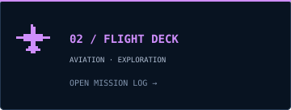
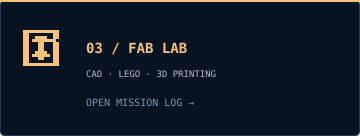

<picture>
  <source media="(prefers-reduced-motion: reduce)" srcset="./assets/observatory-poster.png" />
  
</picture>

**Astronomy first. Building toward the unexplored.**

[Observatory](#observatory) · [Flight deck](#flight-deck) · [Fab lab](#fab-lab) · [Mission log](#mission-log)

<table>
<tr>
<td width="50%"><a href="#observatory"><picture><source media="(prefers-reduced-motion: reduce)" srcset="./assets/observatory-card-static.svg" /></picture></a></td>
<td width="50%"><a href="#flight-deck"><picture><source media="(prefers-reduced-motion: reduce)" srcset="./assets/flight-card-static.svg" /></picture></a></td>
</tr>
<tr>
<td width="50%"><a href="#fab-lab"><picture><source media="(prefers-reduced-motion: reduce)" srcset="./assets/fablab-card-static.svg" /></picture></a></td>
<td width="50%"><a href="#mission-log"><picture><source media="(prefers-reduced-motion: reduce)" srcset="./assets/rover-card-static.svg" /></picture></a></td>
</tr>
</table>

## Observatory

<strong>Open the astronomy mission log</strong>

I'm Kush Modi, a computer science student at NMIMS MPSTME. Astronomy is my biggest passion: telescopes, the night sky, and the things that still feel beyond reach.

The observatory artwork starts with my own telescope-under-the-Milky-Way photograph. The galaxies and spacecraft turn that scene into a place to explore.

**Featured mission — AstroFixxer**

A project built around telescope navigation and star hopping, with celestial targeting and sky exploration.

- [AstroFixxer web project](https://github.com/Zenithquonta/astrofixer-baby)
- [AstroFixxer Android project](https://github.com/Zenithquonta/astrofixxer-android)

## Flight deck

<strong>Open the flight deck</strong>

Aviation, spacecraft, and the possibility of going farther. Star Trek's exploration and Star Wars' spacecraft are part of the visual inspiration for this little universe.

The banner has an exploration vessel, smaller starfighters, and a passenger aircraft crossing beneath the stars. They're expressions of what interests me, alongside the telescope that grounds the scene.

## Fab lab

<strong>Step inside the maker workshop</strong>

Innovation is the other constant: imagining something, building it, and finding out what it can do.

- **LEGO:** building with small pieces and big possibilities.
- **CAD design:** moving an idea into geometry and checking how it fits.
- **3D printing:** bringing the geometry into the physical world.
- **Robotics:** sensing, navigation, and systems that move through real environments.

Look for the rocket on the printer, the rotating wireframe display, the brick-built spacecraft, and the rover outside the workshop.

## Mission log

<strong>Projects, tools, and milestones</strong>

**Robotics — Darwin Club, NMIMS MPSTME**

Autonomous rover work with ROS Noetic, sensor fusion, and navigation. My project log includes first place at the IGVC regional qualifier and fifth overall at the IGVC competition.

**Tools I work with**

Python · C++ · ROS Noetic · Arduino · Linux · Java · MySQL · Git

**Hardware from my robotics projects**

ZED 2i · RPLidar · uBlox GPS · MPU-9250 · Arduino Mega

---

[GitHub](https://github.com/Zenithquonta) · [LinkedIn](https://linkedin.com/in/kushmodi) · [Email](mailto:kushmodi13@gmail.com)

Look up. Build something. Keep going.

