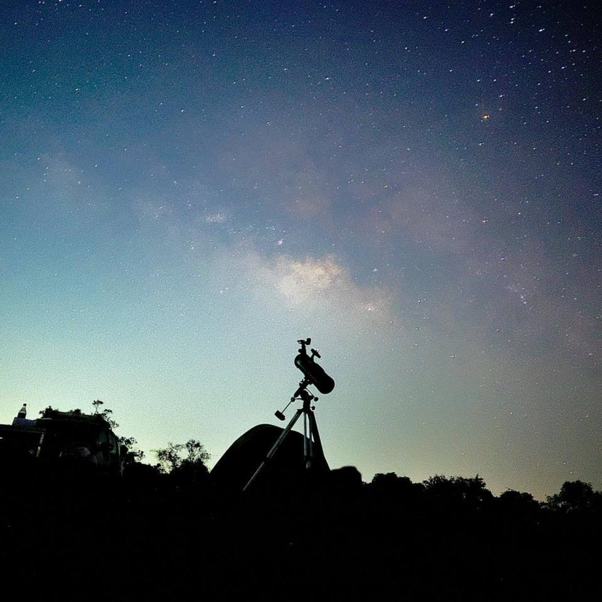
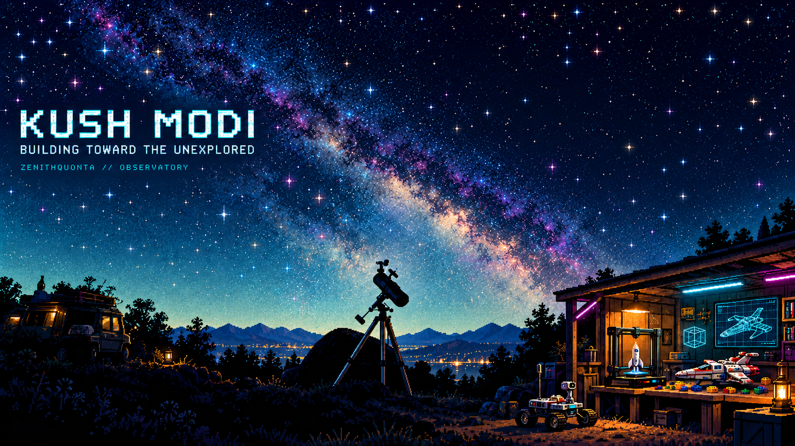
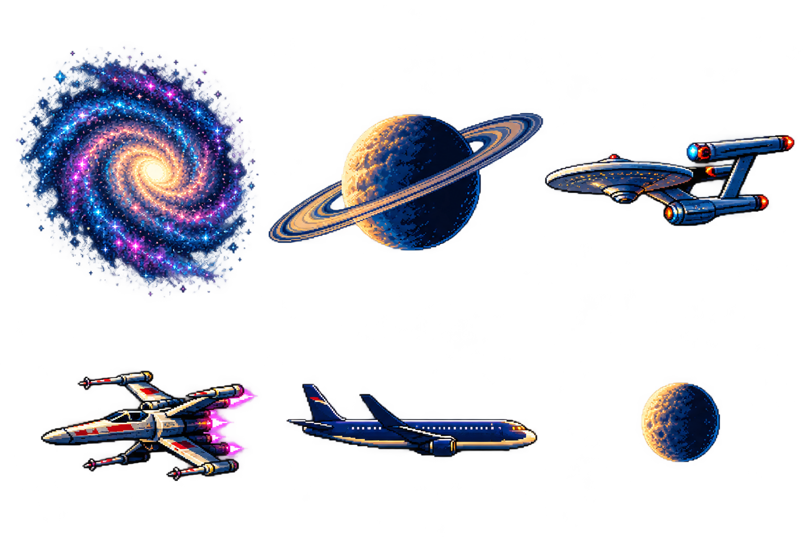

# Scene geometry, motion and rendering specification

## Coordinate system and palette

The artwork coordinate system is **1672×941**. SVG uses the same `viewBox`. The GIF is rasterized to width 1000 and proportional height 563. Do not independently stretch either axis. A responsive page should fit the scene to its container while preserving its aspect ratio.

The quiet text region is roughly x=30..565 and y=218..375. Avoid moving large objects across that region. The telescope occupies the lower-middle, around x=750..860 and y=550..820. The maker workshop occupies the lower-right, starting near x=1170/y=530 and continuing to the right/lower edge. Preserve these landmarks when refining the art.

The matte colors are near-black, midnight blue and teal. Cyan instrument/target colors are around `#00bfff`, `#40daed`, `#72f0ff`. Magenta accents around `#ed78fc` should stay small. The background and artwork supply rich pixel dithering; do not add a full-scene Gaussian blur, glossy gradient panels or a dense overlay of badges.

## Source assets

The background is a carefully edited plate based on the approved concept. Floating sky objects were removed so the renderer can place and animate them independently. The telescope, typography, horizon, buildings and workshop are part of this stable image. It still contains the base printer, CAD display and brick craft; animation details are layered above those objects.

The atlas has six independently usable objects: spiral galaxy, ringed planet, exploration ship, fighter, passenger aircraft and moon. The tool-generated sheet was requested as a 3×2 grid but actual painted margins differ. The builder therefore uses explicit source rectangles and origins rather than blindly treating each cell as a perfect 512px square.

| Sprite | Source rectangle x,y,w,h | Painted origin x,y | Reason |
| --- | --- | --- | --- |
| Galaxy | 0,45,510,545 | 300,328 | Keep the diffuse arm silhouette and rotate around the actual bright core |
| Planet | 512,190,522,315 | 784,346 | Include all diagonal rings without neighboring ship pixels |
| Explorer | 1035,245,500,220 | 1278,346 | Include saucer and both nacelles with a stable hull-centered origin |
| Fighter | 64,680,448,280 | 288,821 | Include splayed wings and bright engines |
| Aircraft | 520,700,515,205 | 784,815 | Include fuselage, wings, tail and nose |
| Moon | 1170,655,300,290 | 1298,805 | Retain its complete crescent silhouette and halo |

These coordinates are part of the current implementation, not an immutable aesthetic rule. If another sprite atlas is generated, inspect it, measure new rectangles/origins and update the map. Do not assume the replacement tool returns identical dimensions.

`sprite()` builds a nested SVG viewport with the source rectangle as its viewBox and a `<use>` reference to the atlas image. Scaling is uniform. Its x/y offset places the chosen painted origin at the containing node's origin. This prevents rotating a galaxy around the geometric centre of a padded cell instead of its core.

## Scene painter order

The scene renders:

1. Background plate.
2. Celestial objects and orbital guide.
3. Moving spacecraft/airplane and attached trails.
4. Extra stars, target path/reticle and meteor.
5. Workshop motion details.

Foreground telescope/trees/buildings are currently baked into the background. Avoid moving sprites below the sky into those foreground objects. If full foreground occlusion becomes necessary, introduce a genuine separate foreground layer through an artistic edit rather than covering objects with arbitrary dark polygons.

## Master time and periodicity

`PERIOD=24` seconds. GIF frame `i` samples time `i / fps`, for i from zero through 239 at the default 10fps. There is no duplicate frame at exactly t=24. The last sample is t=23.9, then the loop returns to t=0. This avoids double-holding a duplicated starting frame.

The common cycles are 3, 4, 6, 8, 12 and 24 seconds, all divisors of the master cycle. Deterministic stars use a seeded random generator so repeated exports have consistent star positions and phases.

## Galaxies

Main galaxy: core position approximately **(810,184)**, displayed width **390**, positive rotation through one full turn in **24 seconds**. Its wings have enough space to turn above and beside the name region. The approved look has a larger more oblique galaxy; the separate sprite makes the core circular and lends itself to rotation. Review the comparison without silently discarding the user's approved composition.

Secondary galaxy: approximately **(1128,228)**, width **137**, opposite rotation through a full turn in **12 seconds**. It adds depth without competing with the main galaxy. Both are stylized celestial motion.

SVG rotation uses `animateTransform`; sampled frames calculate the equivalent angle. In static exports, angle values such as 0 and 360 are visually equivalent but their XML text is not identical. Tests should check geometric/visual periodicity instead of incorrectly expecting every serialized transform string to be equal at wrap.

## Planet and moons

The ringed planet is near **(1480,163)** with displayed width **305**. It moves vertically by about 3 artwork pixels over a 24-second cycle, which is gentle enough to keep it grounded in the sky composition.

The orbital guide is an ellipse with centre **(1480,162)** and radii **150×66**. Two moon sprites of widths **39** and **28** start approximately opposite each other and have **12s** and **24s** cycles.

SMIL projects a circular orbit through a vertically scaled parent and inverse-transforms the moon shape so the moon itself does not become a flattened or spinning bitmap. The sampled GIF coordinates use cosine/sine for the equivalent ellipse.

Known refinement: moons are currently rendered after the planet, so they can appear in front for the full orbit. A more convincing front/back crossing would split the orbit into rear/front layers or use timed occlusion. Review whether this improvement is needed at the actual small README display size.

## Spacecraft and aviation routes

| Object | Width | Lane y | Horizontal range | Cycle | Initial fractional phase |
| --- | --- | --- | --- | --- | --- |
| Explorer | 295 | 385 | 1900 → 490 | 24s | .31 |
| Fighter A | 133 | 438 | 1840 → -170 | 12s | .15 |
| Fighter B | 103 | 475 | 1840 → -170 | 12s | .20 |
| Airplane | 142 | 524 | -200 → 1830 | 24s | .23 |

The sampled position is `start + (end-start) * ((t/period + phase) % 1)`. SMIL uses negative animation start times to begin at the same approximate phase without waiting through an empty intro.

The exploration ship has a clip zone starting at x=574, keeping the large vessel out of the name region. It should disappear naturally off that boundary; inspect whether its fade or clip feels abrupt. Fighters remain lower than the typography. The airplane passes below the text and above the horizon/workshop roof.

Trails are drawn in the same transform group as the object, so they follow the ship rather than staying fixed in the scene. They are short, restrained paths, not giant neon beams. Preserve relative ship facing: spacecraft head left, passenger airplane right.

## Stars, meteor and target instruments

32 possible extra star crosses are seeded with `Random(29)`. Any generated star within the quiet name rectangle is skipped. Their opacity periods are selected from 3/4/6/8 seconds with independent phases. These are supplementary twinkles on the stable detailed background, not a replacement for its Milky Way texture.

A dotted cyan target trajectory leads from near the telescope toward the target reticle, then toward the planetary area. It must explicitly use `fill="none"`; an open multi-segment path otherwise fills an unintended dark triangle. This was an actual observed defect in an early rendered frame and has been fixed.

The reticle is a four-corner stroked shape near (1020,97) with a subtle 3-second opacity cycle. Keep it small and translucent so it reads as an instrument overlay, not a large application UI.

The meteor uses a 12-second cycle with visibility only in roughly the first 16% of the cycle. A short line and bright head move diagonally from around (1100,380) toward (1490,530). Review the speed and fade on actual playback so it does not look like a permanently parked dash.

## Workshop

The wireframe cube is centred near **(1435,697)** with a size around 36px. Eight cube vertices are yaw-projected, and twelve edges are drawn. GIF frames calculate the projection at time t; SMIL interpolates 25 projected poses over **6 seconds**.

The print-head overlay is near x=1335±20, y=727, 9×5px. The scanner line sits near x=1318, y=749±18, width 39px and height 1.6px. These movements suggest an active printer. The underlying rocket remains drawn in the background; the current code does not realistically accumulate extrusion layers from zero. If a genuine build-up effect is implemented, retain the rocket/pixel style and use a clean source plate rather than covering it with arbitrary rectangles.

Four small workshop/rover LEDs pulse near (1596,775), (1380,733), (1196,816), and (1505,591). They should be discovered on closer viewing, not become large flashing distractions.

Known parity review: nozzle/scan/LED SMIL currently uses simple value interpolation while the GIF uses sine-derived samples. Pick a consistent interpolation or document an intentional difference. This is a small implementation refinement, not permission to replace the approved image.

## Formats and accessibility

The animated SVG includes all PNG resources as data URIs and reuses them internally. No JavaScript, external font or foreign object is embedded in the SVG. Its reduced-motion media rule switches from `.moving` to `.still` groups.

The GIF is used in README for portability. A static PNG of matching dimensions is supplied through the `<picture>` element for reduced motion. Confirm GitHub's actual renderer retains the picture/source behavior. If not, provide a clearly accessible static alternative without pretending the GIF can respect media queries by itself.

The local preview has a real button for pause/resume, named hotspot buttons, visible focus and native expandable logs. Do not rely only on hover. Test the square image in a circular preview at small sizes; it is a static matching profile picture, not a promise that GitHub animates account avatars.

## Export controls and quality limits

Default export is 1000px wide at 10fps. Consider 840px at 10fps or 1000px at 8fps if file size is excessive, but compare the quality at the actual rendered size. Increasing to 12fps smooths traffic but increases frames and bytes. More complex halos or full-scene motion can inflate GIF size quickly.

The quality gate's 25MB budget is a review ceiling, not a requirement to approach it. Prefer smaller files when readability, pixel texture and perceived movement remain intact. Check shared-palette dithering for crawl/noise around sprite edges. Do not shrink and blur the scene so the user's distinctive telescope silhouette disappears.

Use inspected screenshots/frame samples and recorded playback, if available, as review evidence. Do not certify aesthetic correctness from XML parsing alone.
