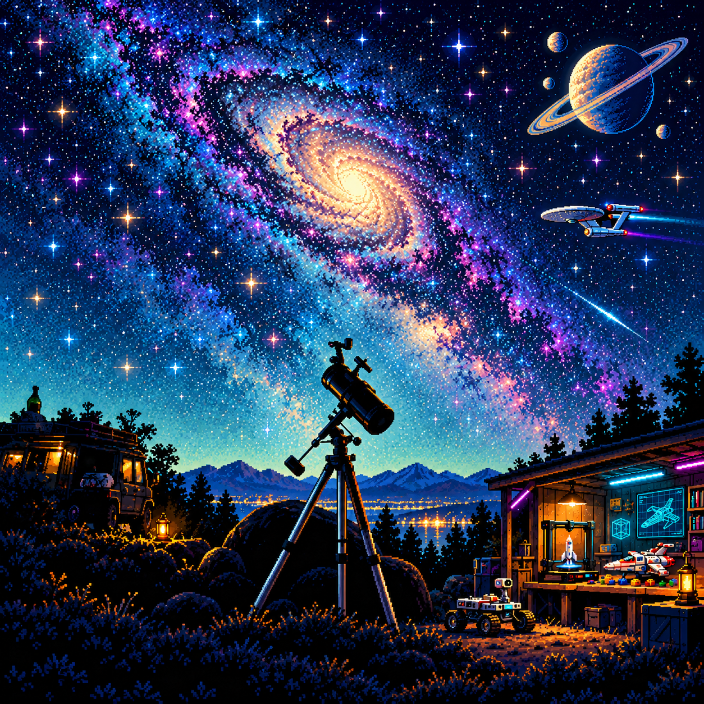

# Artwork and output registry

`assets/MANIFEST.json` supplies machine-readable size, hash and image metadata for every asset. Refresh it after final changes. This document explains intent and origin.

## Active artwork

| Path | Role | Treatment |
| --- | --- | --- |
| `assets/reference-telescope.jpg` | User-uploaded source photograph | Preserve; foundation of the personal scene, not a human portrait |
| `assets/approved-concept.png` | User-approved still banner | Preserve as the visual baseline |
| `assets/observatory-background.png` | Edited stable scene plate | Typography, telescope, foreground and workshop stay here |
| `assets/space-sprites.png` | Transparent moving-object atlas | Galaxy, planet, exploration ship, fighter, plane and moon |
| `assets/profile-picture.png` | Square matching pixel profile image | Static image; small/circular presentation review remains |
| `assets/observatory.svg` | Self-contained animated scene | All motion is declarative SVG; no JavaScript dependency |
| `assets/poster.svg` | Static time-zero scene | Regenerable; useful to inspect composition |
| `assets/observatory-poster.png` | Static raster fallback | Match GIF dimensions; reduced-motion and loading fallback |
| `assets/observatory.gif` | Portable actual looping hero | Current README source |
| `assets/observatory-card.svg` | Pixel astronomy navigation panel | Link to README Observatory anchor |
| `assets/flight-card.svg` | Pixel aviation navigation panel | Link to README Flight Deck anchor |
| `assets/fablab-card.svg` | Pixel maker navigation panel | Link to README Fab Lab anchor |

## Archived prototypes

The user rejected the original ASCII approach. Its generated SVGs are included only because the user requested all created SVGs in the handoff. They are under `assets/legacy/` and are not linked by the active README:

- `ascii-portrait.svg`: typing terminal-icon prototype, not a pixel copy of a human face.
- `ascii-wordmark.svg`: rotating ASCII wordmark prototype.
- `demo-contributions.svg`: explicitly labelled sample contribution calendar; it is not real GitHub activity and must never be presented as real stats.

Do not put these prototypes back into the new hero. Do not use the demo contributions in the public profile. A future real activity integration would need actual data and its own acceptance checks; it is not necessary for the current observatory design.

## Source generation and reproduction

The source imagery was created with image generation/editing using the supplied photograph and approved concept. Reproduction from a prompt alone is not pixel-identical. The actual PNGs, explicit crop regions and script are therefore part of the handoff.

The animation is reproducible from the supplied PNGs using `scripts/build_animation.py` and FFmpeg/librsvg. Navigation cards are reproducible from `scripts/build_cards.py`. The preview is reproducible from the template and `scripts/build_preview.py`.

For artistic regeneration, use the intent and compositions described in `HANDOFF.md` and the approved/reference images. Inspect the new asset dimensions, transparency, painted margins and origin positions before using it. An atlas that visually resembles the old one may still require new sprite crop coordinates.

## Manifest fields

Each asset entry includes relative path, byte size, SHA-256 and a role label. Raster images additionally include width/height and mode. GIF entries include frame count, loop metadata and total duration. SVG entries include width/height/viewBox and counts of declarative animation nodes.

The manifest itself is omitted from its own hash inventory. Temporary frames, Python caches and local runtime evidence are not artwork assets. Retain separate verification output under `docs/` if useful; do not store credential dumps or full process environments.
